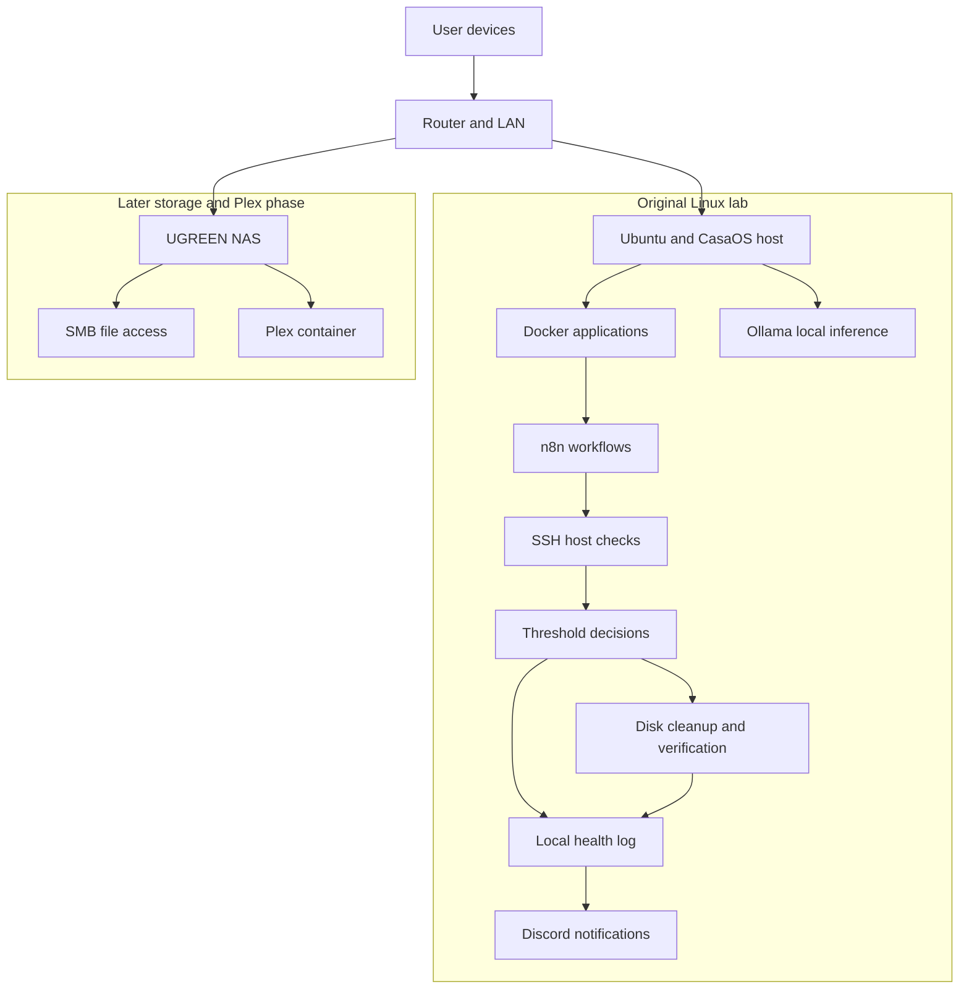

# Linux Monitoring and Recovery Lab

A personal Linux home lab focused on **monitoring, troubleshooting, and bounded recovery**. I used Ubuntu, CasaOS, Docker, and n8n to work through host health checks, local event logging, Discord notifications, and a disk-cleanup recovery workflow. I also ran Ollama locally and later moved Plex and media storage to a UGREEN NAS.

I built this lab to learn how to operate services, diagnose failures, and turn repeatable checks into workflows. It supports my transition from physical security and operations into IT and cybersecurity.

## What the project demonstrates

| Area | Work represented here |
| --- | --- |
| Linux administration | Ubuntu/CasaOS operation, SSH commands, storage checks, and investigation of service behavior |
| Monitoring | n8n branches for host checks; Uptime Kuma availability monitoring and deliberate failure testing |
| Recovery | Disk usage check → diagnosis → journal/package-cache cleanup → usage verification |
| Logging and alerts | Local health-log entries and Discord notification branches recorded in the build discussions |
| Containers | Docker-hosted applications; investigation of container connectivity, resource limits, and storage paths |
| Local AI | Ollama model/API tests and troubleshooting of chat-interface latency |
| Networking and storage | Tailscale remote access troubleshooting, NAS SMB configuration, and Plex library/storage troubleshooting |

**Evidence boundary:** this repository reconstructs the available project history. It includes three cleaned-up Bash scripts derived from recovered disk commands, not a complete deployment export. The record describes successful monitoring/recovery tests, but some results survive only in conversation recaps. Scheduling, an automated AI-to-recovery connection, and unrestricted service/container repair are not claimed. See the [accuracy review](PROJECT_ACCURACY_REVIEW.md) and [source provenance](docs/source-provenance.md).

## Architecture

This is a logical overview, not a map of live addresses or a literal n8n node export. The original monitoring host and later NAS phase are separate: the history does not establish that the monitoring stack moved to the NAS. Local inference was tested; no verified connection from AI output to recovery execution is drawn.

## A concrete recovery example

The disk branch checked root-filesystem usage with `df`, used a threshold above 80%, and investigated usage with `du`. Its recovery action vacuumed archived journal files older than seven days and cleaned the downloaded APT package cache. It then checked usage again and reported the result.

That is deliberately limited recovery: successful command execution does not prove the disk problem is solved. The verification result is a separate decision. The history does not demonstrate retry limits, cooldowns, or a complete escalation implementation. [Read the recovery design and limits](docs/self-healing.md).

## Start here

| Reader | Suggested route |
| --- | --- |
| Recruiter or hiring manager | [Portfolio overview and interview explanation](docs/portfolio.md), then [troubleshooting cases](docs/troubleshooting.md) |
| Technical reviewer | [Architecture](docs/architecture.md), [monitoring](docs/monitoring.md), [recovery](docs/self-healing.md), [script provenance](scripts/README.md) |
| Someone reviewing the code | [Setup and safe local checks](docs/setup.md), [validation results](docs/validation.md), [security review](PUBLIC_REPOSITORY_SECURITY_REVIEW.md) |

### Included code

- [`disk_usage.sh`](scripts/health-check/disk_usage.sh): reports filesystem usage as an integer for a threshold check.
- [`disk_diagnose.sh`](scripts/monitoring/disk_diagnose.sh): reports the ten largest first-level entries within one filesystem.
- [`disk_cleanup.sh`](scripts/maintenance/disk_cleanup.sh): preserves the recovered cleanup actions; defaults to a preview and requires `--apply` to run them.

The public wrappers add documentation, validation, and failure handling. These changes were made while preparing the portfolio and are not presented as the original deployed files. A mock-based test suite checks them without cleaning the machine running the tests.

## Key Skills Demonstrated

Linux administration · Docker troubleshooting · SSH and network troubleshooting · System monitoring · n8n workflow configuration · Shell command composition · Log interpretation · Bounded recovery · NAS/SMB · Infrastructure documentation

The local AI work demonstrates model hosting and API/UI troubleshooting. It does not establish professional SOC experience, SIEM deployment, or autonomous AI administration.

## Security and privacy

Actual addresses, endpoints, account names, paths containing personal identifiers, webhook values, and raw logs are omitted. There are no screenshots, credentials, deployment exports, or Git history in this release. Configuration examples describe only supported behavior and are marked when incomplete. Read [SECURITY.md](SECURITY.md) before adapting anything.

## What I learned and what comes next

The strongest lessons were checking the correct endpoint, separating host health from application health, verifying a recovery action, and distinguishing container paths from client-visible paths. [Lessons learned](docs/lessons-learned.md) explains the reasoning behind those conclusions.

Next steps are to add sanitized original workflow exports, capture real test evidence, verify scheduling and recovery limits, and document the exact AI monitoring inputs/outputs if that integration is retained. These are future documentation or engineering tasks, not implemented features of this release.
