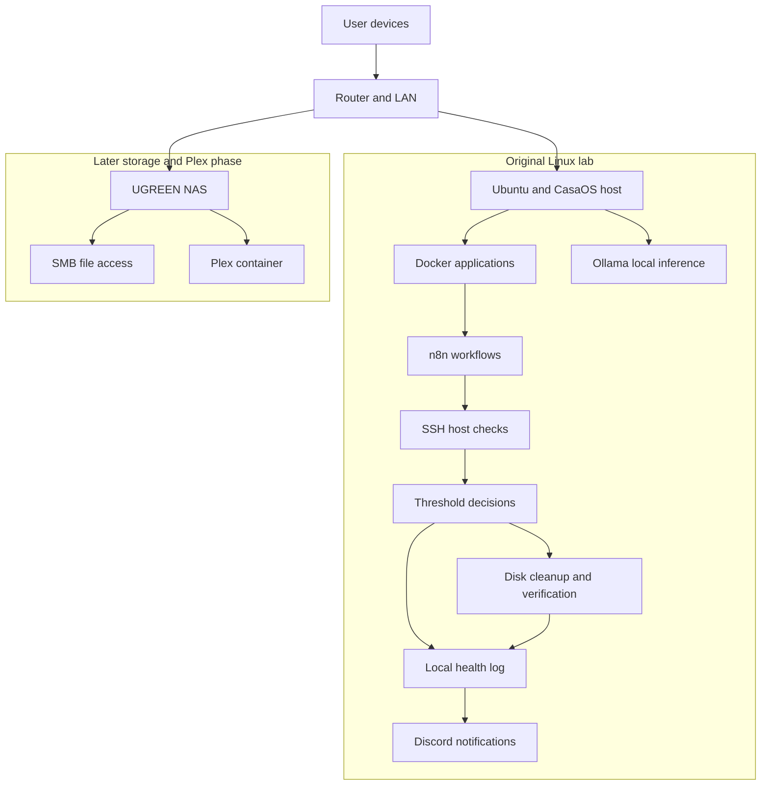

# Linux Monitoring & Recovery Lab

A personal Linux home lab focused on **monitoring, troubleshooting, and bounded recovery**. I used Ubuntu, CasaOS, Docker, and n8n to work through host health checks, local event logging, Discord notifications, and a disk-cleanup recovery workflow. I also ran Ollama locally and later moved Plex and media storage to a UGREEN NAS.

I built this lab to learn how to operate services, diagnose failures, and turn repeatable checks into workflows. It supports my transition from physical security and operations into IT and cybersecurity.

## What the project demonstrates

| Area | Work represented here |
| --- | --- |
| Linux administration | Ubuntu/CasaOS operation, SSH commands, storage checks, and investigation of service behavior |
| Monitoring | n8n branches for host checks; Uptime Kuma availability monitoring and deliberate failure testing |
| Recovery | Disk usage check → diagnosis → journal/package-cache cleanup → usage verification |
| Logging and alerts | Local health-log entries and Discord notification branches recorded in the build discussions |
| Containers | Docker-hosted applications; investigation of container connectivity, resource limits, and storage paths |
| Local AI | Ollama model/API tests and troubleshooting of chat-interface latency |
| Networking and storage | Tailscale remote access troubleshooting, NAS SMB configuration, and Plex library/storage troubleshooting |

**Project scope:** this repository documents the portions of the lab that I was able to preserve accurately. It includes three Bash scripts derived from the disk-monitoring and recovery commands I used, but not a complete n8n deployment export. Some branch behavior is documented from project notes where the original executable artifacts were no longer available. Scheduling, an automated AI-to-recovery connection, and unrestricted service/container repair are not presented as completed features. See the [n8n monitoring and recovery notes](docs/n8n-monitoring-recovery.md) for the technical walkthrough.

## Architecture



## Repository guide

The repository is organized around the parts of the lab that are most useful to review:

| Path | What it contains |
| --- | --- |
| [n8n monitoring & recovery](docs/n8n-monitoring-recovery.md) | Detailed workflow behavior, preserved commands, monitoring branches, logging, alerts, and recovery boundaries |
| [Architecture](docs/architecture.md) | How the Linux host, Docker services, n8n, Ollama, NAS, SMB, and Plex fit together |
| [Troubleshooting](docs/troubleshooting.md) | Case studies from availability testing, disk recovery, remote access, Plex, and local AI troubleshooting |
| [Project scope](docs/project-scope.md) | Clear separation between implemented, tested, and planned work |
| [Security considerations](docs/security-considerations.md) | What was intentionally sanitized and how automation boundaries were handled |
| [Scripts](scripts/README.md) | Disk usage, diagnosis, and bounded cleanup scripts preserved from the project |

## Key workflow

The disk-capacity branch is the most complete end-to-end example in the repository:

```text
Read disk usage
      ↓
Above threshold?
   ┌──┴──┐
   No   Yes
   ↓     ↓
Healthy Diagnose
          ↓
       Cleanup
          ↓
        Verify
          ↓
      Log + Notify
```

The important design choice is that recovery is followed by a new measurement. A cleanup command succeeding is not treated as proof that the original problem has been resolved.

## What I learned

This lab gave me hands-on practice with Linux administration, Docker-hosted services, SSH-based checks, threshold logic, service monitoring, bounded remediation, post-remediation verification, remote-access troubleshooting, local AI hosting, and NAS-backed storage.

It also reinforced a few operational habits: validate monitoring with controlled failures, troubleshoot one layer at a time, separate service health from data/index health, and keep credentials and live infrastructure details out of public repositories.
