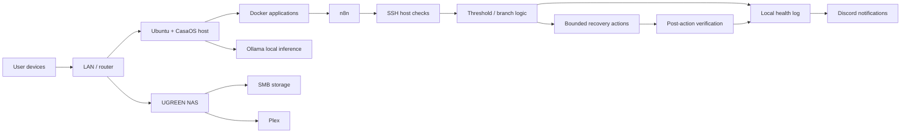

# Architecture

The lab started as a Linux self-hosting environment and expanded into monitoring, recovery automation, local AI experimentation, and later NAS-backed storage.

## High-level layout



## Monitoring path

n8n acted as the orchestration layer. Host checks were executed over SSH, converted into simple values or status fields, and then evaluated by branch logic.

The general pattern was:

```text
Collect → Evaluate → Diagnose → Recover when appropriate → Verify → Log → Notify
```

The disk-capacity branch is the best-preserved example because the original command logic survives and is reproduced in the repository.

## Recovery boundary

Recovery was intentionally narrow. The disk workflow could clean archived journal data and the APT package cache, but it did not have general authority to execute arbitrary AI-generated shell commands or restart any service automatically.

Verification was treated as its own step. A successful cleanup command did not automatically mean the capacity problem was solved.

## Availability monitoring

Application availability was monitored separately from host-health checks. Controlled stop/start testing was used to verify that the monitor could actually detect a DOWN state instead of trusting a permanently green dashboard.

## Local AI

Ollama was hosted locally for model/API testing. I explored how local AI could assist with interpreting telemetry, but I did not give model output unrestricted recovery authority.

## Storage phase

Later in the project, Plex and media storage moved toward the NAS. SMB access was configured and tested, and Plex library/storage behavior became part of the troubleshooting work.

## Design lessons

The architecture reinforced a few practical lessons:

- monitoring should be tested with deliberate failures
- recovery actions should be limited and reversible where possible
- verification should follow remediation
- credentials and environment-specific identifiers should remain outside public documentation
- monitoring a host from services running on that same host does not provide independent whole-host outage detection
